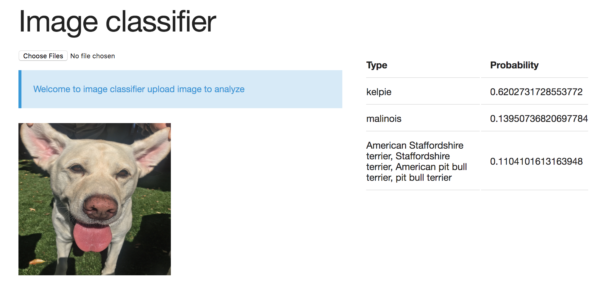

# Node Image Classifier

A barebone nodejs app, using Express and tensor-flow (tfjs), to identify any uploaded image using mobilenet model

### Running locally

Make sure you have latest version of docker (Docker version 19.03.1) and docker-compose (docker-compose version 1.24.1)

    $ git clone https://github.com/ssawant/node-image-classifier.git
    $ cd node-image-classifier
    $ docker-compose up

Your app should be running on localhost:8080